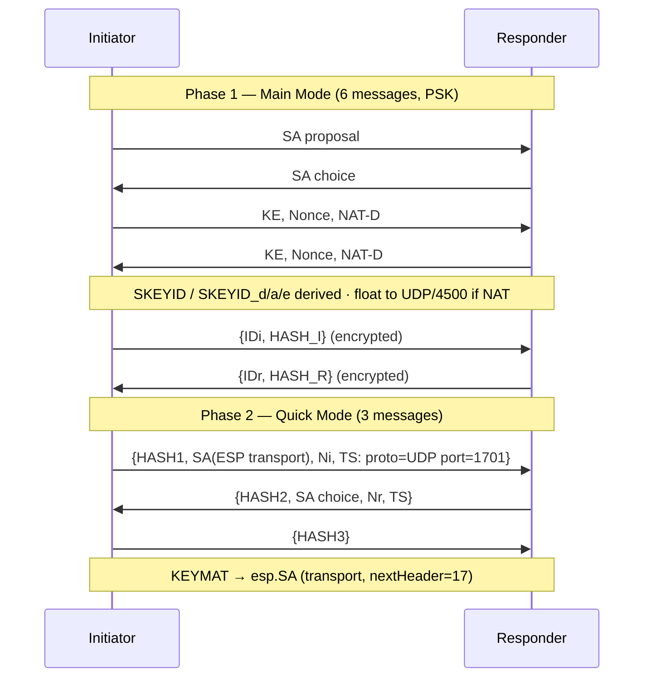

# internal/ikev1

The IKEv1 (ISAKMP/Oakley) key exchange that keys the IPsec transport-mode SA under
L2TP/IPsec. A Main Mode initiator and responder with PSK authentication, Quick Mode
to negotiate an ESP transport SA for UDP/1701, and NAT-T so ESP floats to UDP/4500.

This is what every native-OS L2TP/IPsec client speaks (Windows, macOS, iOS,
Android) and what a stock xl2tpd/strongSwan deployment uses — which is why
L2TP/IPsec needs IKEv1, not the IKEv2 the rest of veepin runs.

## Specifications

- [RFC 2408](https://www.rfc-editor.org/rfc/rfc2408) — ISAKMP; [RFC 2409](https://www.rfc-editor.org/rfc/rfc2409) — IKE (Main/Quick Mode); [RFC 2407](https://www.rfc-editor.org/rfc/rfc2407) — IPsec DOI.
- [RFC 3947](https://www.rfc-editor.org/rfc/rfc3947) / [RFC 3948](https://www.rfc-editor.org/rfc/rfc3948) — NAT-T detection and UDP-encapsulated ESP.

Primitives (MODP DH, HMAC PRF, AES-CBC) come from [`cryptoutil`](../cryptoutil);
the ESP data path is [`ikev2/esp`](../ikev2/esp) in **transport** mode.

## Main Mode + Quick Mode

## API surface

- `NewSession(Config) *Session` — drives either role; `Role` (`Initiator`/`Responder`).
- `Config`, `Handler`, `Result` (the keyed ESP transport SA parameters).
- `InitiatorCookie(msg) ([8]byte, bool)` — demux by ISAKMP initiator cookie.

## Implementation notes & caveats

- **Phase-1 crypto is byte-exact or nothing.** SKEYID derivation and the CBC IV
  chaining across Main Mode messages must match strongSwan exactly, or the
  encrypted ID/HASH payloads won't decrypt. This is the finicky part — pinned by
  known-answer tests and interop.
- **Quick Mode traffic selectors are pinned to `proto=UDP, port=1701`** — the SA
  protects L2TP, not arbitrary traffic. The resulting KEYMAT feeds
  `esp.SA` in **transport** mode with `nextHeader=17` (UDP), unlike the IKEv2
  tunnel-mode path.
- **NAT-T is forced deterministic between containers.** NAT-D payloads detect NAT;
  where same-L2 peers wouldn't, ESP is still UDP-encapsulated on 4500 so framing is
  predictable (mirroring the IKEv2 data path).
- **Retransmissions replay ciphertext, not state transitions.** An exact repeat
  of the last accepted request gets the cached response even after the state
  advances (MM5 while awaiting Quick Mode is the important case). Neither the
  CBC IV nor the retry budget changes. L2TP sends responses on the client's
  observed IKE transport, including clients that float only after MM6.
- **Endpoint changes require authentication.** The L2TP socket adapter commits
  the peer's address inside the Main/Quick Mode responder's authentication
  callback, before the reply is sent; established Informational packets also
  verify their HASH first. Cached retransmissions cannot authorize rebinding.
  TunnelForge's late float is an explicit compatibility exception to RFC 3947
  section 4, not the standard Main Mode sequence.
- **Initiators offer AES-CBC-256 with SHA-256 or SHA-1 and MODP-2048.** L2TP
  responders additionally accept AES-CBC-128 in both IKE and ESP for peers such
  as TunnelForge v0.7.4. The same negotiated length drives key derivation and
  encryption. Cisco profiles and initiator offers are unchanged; 3DES and
  MODP-1024 remain unsupported. AES-128/SHA-1 compatibility does not provide
  proof that every native client is interoperable.

## Managed L2TP lifecycle

`Config.ManageLifetime` is enabled by the L2TP engine only. Each Quick Mode
owns its message ID, CBC IV and retry state. Repeated Quick Mode can start from
either side; completed exchanges cache replies for 30 seconds and message IDs
are not reused within the control SA. State is bounded to 32 cached exchanges,
1024 used message IDs and 8 overlapping control SAs.

The local time ceiling defaults to 3600 seconds for both phases. A shorter peer
lifetime wins locally. Main/Aggressive/Quick Mode responses preserve the selected
offer's attributes, including omitted and volume lifetimes (RFC 2409 section 5).
The local timer limit is not written back into the response. Initiators reject
modified attributes; unknown or duplicate attributes are not silently accepted.
SA parsing supports numbered alternative proposals and alternative transforms,
preserving the chosen proposal's SPI and attributes, including zero-based
proposal/transform numbering. Same-number multi-protocol
bundles are skipped as a whole; an ESP member is never selected on its own.
ESP renews at 80% (initiator) or 90% (responder); IKE starts fresh
Main Mode at 75%. IKE renewal uses UDP/4500 and new cookies/DH/nonces, checks the
same authenticated identity, and keeps the existing PPP session. Multiple control SAs can coexist after crossed renewal; the two peers need
not prefer the same one. Older control SAs still accept authenticated Quick Mode
and Informational traffic until their deadline. The selected ESP SA has an
owner-wide hard deadline, independent of which control SA negotiated it.

ESP accepts simultaneous seconds and kilobytes limits (RFC 2407 sections
4.5.2–4.5.4), counting protected plaintext per direction and requesting rekey at
80% of the volume limit. Expired ESP packets and sequence wrap are rejected.
An expired/deleted IKE SA cannot create more ESP SAs, but does not by itself
expire an independently valid ESP SA. An authenticated Delete for an old ESP
pair removes only that pair; deletion of the current pair ends the session.
IKE byte lifetimes and Quick Mode PFS remain unsupported and are rejected.

`lifecycle_test.go` covers timed renewal across several lifetimes, crossed IKE
renewal, both Quick Mode roles, lost QM3, authenticated Delete and expiry.
`../l2tp/engine_test.go` additionally checks real loopback UDP, preserved PPP and
bidirectional packets after renewal. These are self-interoperability tests;
Windows, iKuai and independent strongSwan long-run verification are separate gates.

## Wire validation boundaries

NAT-T advertises RFC 3947 only; incompatible draft payload numbering is not
advertised. UDP transport Quick Mode sends both NAT-OA addresses. Selector pairs,
reply equality, local L2TP service ports, nonce lengths, ISAKMP version and DPD
DOI/protocol/SPI/cookie fields are checked. Original addresses and selectors are
passed with each ESP SA, including overlapping rekeys. The temporarily retained
TunnelForge MM5/MM6-on-UDP/500 behavior above remains an explicit exception;
this fork must not be described as having no protocol exceptions.
