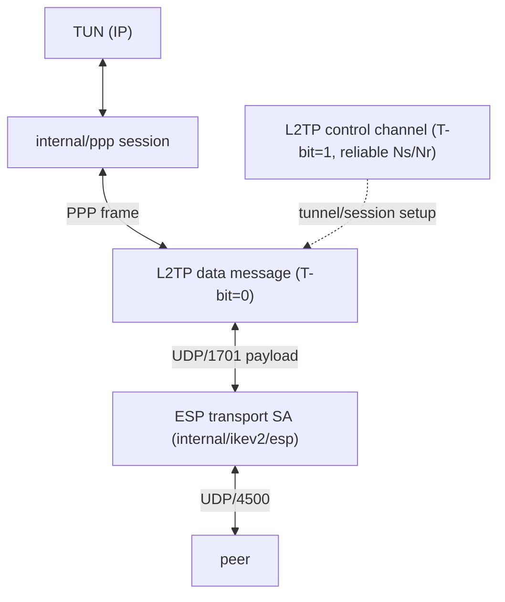
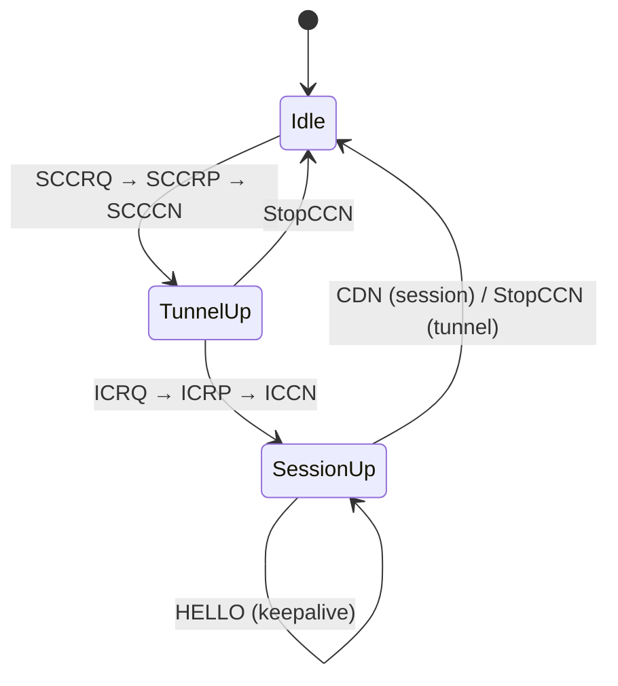

# internal/l2tp

The L2TP control and data channels that carry a PPP session over IPsec
transport-mode ESP — the "L2TP/IPsec" a stock xl2tpd/strongSwan stack and every
native-OS client speak. Both roles: the LAC (client, initiator) opens the tunnel
and places the call; the LNS (server, responder) accepts them.

## Specification

- [RFC 2661](https://www.rfc-editor.org/rfc/rfc2661) — L2TP (header §3.1, AVP format §4.1, control state machine §7).

The engine is **transport-neutral**: it writes finished L2TP datagrams through a
send closure and is fed inbound datagrams by its owner, so the same `Tunnel` runs
over a bare UDP socket (tests) or inside an ESP transport SA (production).

## Layering

## Control channel state machine

Reliable (Ns/Nr sequenced, acked, retransmitted). Tunnel then session:

Control vs data is demuxed by the header **T-bit**.

## API surface

- **Client (LAC)** — `NewClient(conn, tun, ClientConfig) *Client`; `RoleLAC`.
- **Server (LNS)** — `NewServer(rawIKE, rawNATT, tun, ServerConfig) *Server`.
- **Tunnel engine** — `NewTunnel(role, send, handler) *Tunnel`; `Role`, `Handler`,
  `NetConfig` (assigned addressing).

## Implementation notes & caveats

- **AVP hiding is not implemented — deliberately.** veepin never sets a tunnel
  secret, so no outbound AVP is obfuscated; mandatory hidden AVPs are rejected and optional hidden AVPs are ignored.
- **The control channel must be reliable before anything works** — Ns/Nr
  sequencing, acking, and retransmission turn UDP into an ordered channel, exactly
  as [`openvpn/reliable`](../openvpn/reliable) does for OpenVPN (different wire, same
  problem).
- **Transport-neutral is the key property.** The `Tunnel` doesn't own a socket or
  the ESP SA; wiring it to a bare UDP socket (tests) vs an ESP transport SA
  (production) is the owner's job. This is what makes the state machine unit-testable
  without IPsec.
- **HELLO is sent as well as answered, and its ZLB is the liveness proof.** This
  end answered a peer's HELLO from the start and never sent one, so an idle
  tunnel queued nothing, the retransmit timer had nothing to retransmit, and a
  tunnel whose ESP transport had gone quiet stayed up forever carrying nothing.
  `Tunnel.SendHello` waits for its own Ns to leave the unacked window — HELLO has
  no reply of its own, so the acknowledgement the reliable channel requires of
  every message is the whole answer. One probe crosses both layers that can go
  quiet here: the ESP transport SA and the L2TP control connection inside it.
- Data messages carry PPP frames handed to [`internal/ppp`](../ppp); the inner IP
  ultimately rides TUN ⇄ PPP ⇄ L2TP ⇄ ESP.

## Server cleanup and liveness

Half-open admission slots are released exactly once on IPsec establishment or
failure. Setup must reach PPP network-up within 60 seconds. Established sessions
send an encrypted L2TP HELLO every 30 seconds. RFC 2661 section 5.8 exponential
backoff retries at 1, 3, 7, 15 and 23 seconds, clearing an unresponsive tunnel
at 31 seconds. The monitor waits for this reliable-channel result instead of
imposing a competing shorter deadline. Advancing acknowledgements reset the
oldest outstanding message's retry budget. Silent peers release
their IP, packet device, indexes and protocol timers. Socket or TUN read failure
is returned from Serve rather than leaving a partially listening server healthy.

The receive path keeps unexpired overlapping ESP SAs during rekey and checks
their deadlines on every packet. Expired index entries are pruned by the monitor.
Shared CBC/HMAC state is serialized separately in each ESP direction, including
when a timer sends a control packet concurrently with application traffic.

## Protocol validation and graceful teardown

Control headers require L/S, correct tunnel/session identifiers and the first
mandatory Message-Type AVP. Required AVPs and lengths are checked; unknown
mandatory capabilities terminate negotiation instead of being silently accepted.
A one-message congestion window fits every valid peer receive window. Data
sequencing follows RFC 2661 section 5.4 and honors Sequencing Required.

The server stops business traffic immediately on graceful close but retains the
control/ESP mapping for 31 seconds to retransmit StopCCN and acknowledge repeated
peer close messages. Carrier failure or server shutdown aborts immediately.
Quick Mode selectors are retained per SA; UDP lengths, ports and nonzero
checksums are verified using NAT-OA pre-NAT addresses. Initiator ephemeral L2TP
ports are supported. Only IPv4 transport-mode L2TP is admitted.

PPP network-up supplies the negotiated outbound MTU to PacketDeviceFactory.
The device must configure its stack with that value. The OS-TUN path fragments
IPv4 without DF and uses ICMP fragmentation-needed for oversized DF packets;
shaping cannot pad beyond the peer MRU. These checks are regression coverage,
not a claim of universal conformance or Windows/iKuai 24-hour certification.
